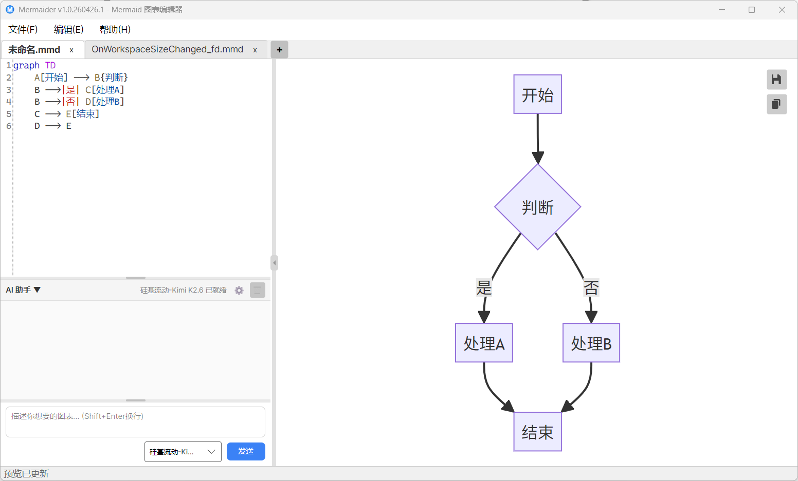
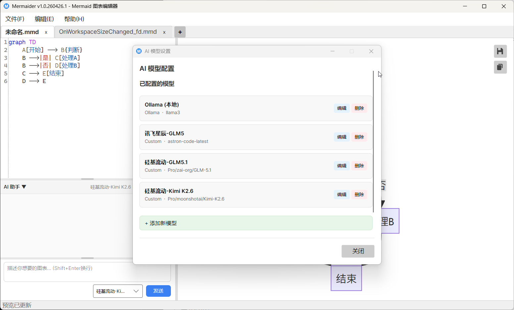

# Diagramon - Multi-format Diagram Editor

[中文文档](README.zh-CN.md)

A **local-first** multi-format diagram editor built with C# Avalonia. Supports **Mermaid** (`.mmd` / `.mermaid`), **Graphviz DOT** (`.dot` / `.gv`), **drawio** (`.drawio`) and **Excalidraw** (`.excalidraw`) — all four can be edited and previewed live. Features code editing with syntax highlighting, real-time preview with identical pan/zoom/fit gestures across all four views, syntax validation, high-resolution PNG export and clipboard copy, plus an AI assistant that works either with your own API key (BYOK) or through the membership cloud gateway (including **image recognition**: pick a screenshot → diagram code).

**Rendering and syntax checking happen entirely on this machine** (Node and Chrome headless ship inside the package; no external requests). Only when you **actively use AI** are the relevant code/image sent to the model service: BYOK talks straight to your own upstream, membership goes through the Diagramon cloud gateway.

Version **v2.0.260929.0**

## Screenshots





## Features

### Code Editing
- **Syntax Highlighting** - Each format ships its own Xshd definition: Mermaid covers keywords, directives, node IDs, edge labels, participant names, class members; DOT covers keywords, attribute names, edge operators, strings and comments (`//`, `/* */`, line-start `#`)
- **Find & Replace** - Integrated SearchPanel for code search/replace
- **Multi-tab** - Edit multiple files independently with close buttons and mouse wheel tab switching
- **Debounced Rendering** - Auto-renders after 350ms of inactivity to avoid excessive refreshes
- **Context Menu** - Right-click context menu: Undo, Redo, Cut, Copy, Paste, Select All
- **Close Tab Confirmation** - Save / Don't Save / Cancel dialog when closing unsaved tabs; prompted on app exit for all modified tabs
- **Crash Protection** - Unhandled exceptions are captured to `%LOCALAPPDATA%/Diagramon/crash.log`

### Real-time Preview
- **JavaScript Injection** - Initial load via WebView file navigation; subsequent updates use CoreWebView2.ExecuteScriptAsync for zero-latency script injection
- **Off-screen Rendering** - SVG rendered in an absolutely-positioned off-screen container to avoid layout interference
- **Canvas gestures (identical in all four views)** - the Mermaid / DOT preview panes and both embedded canvases (drawio / Excalidraw) share one set of "look" gestures: **wheel = pan**, **Shift+wheel = horizontal pan**, **Ctrl+wheel = zoom (anchored at the cursor)**, **drag = pan** (a canvas keeps left-drag for selection and pans with the middle button or space+drag), **double-click = fit to view**; `Ctrl+0` (fit), `Ctrl+=` (zoom in one step) and `Ctrl+-` (zoom out one step) are forwarded by the app to whichever surface is active (preview pane 20%–3000%, drawio 5%–1600%, Excalidraw 10%–3000% - each keeps its native limits). What "fit" means follows each format's own whole picture: the preview pane and Excalidraw fill the view with the **content**, drawio fills it with the **page** (its own Fit Page - a single small shape is never blown up)
- **Status bar zoom** - the percentage at the right of the status bar shows the zoom of the *active* view (the preview page reports it, a canvas reports it through `window.__hostZoom`); both canvases' own zoom readouts are hidden so two numbers can't disagree on screen
- **Error Display** - User-friendly error messages shown directly in the preview area
- **Toggle Editor** - Click the triangle button (▶/◀) in the splitter bar to hide/show the editor for full-screen preview
- **Rendering Cache** - LRU cache (32 entries max) + background PNG generation after preview
- **WebView shortcuts** - when the preview pane or a canvas has focus (keys land on the WebView first, so window-level accelerators never see them), the carrier page intercepts `Ctrl+S` / `Ctrl+Shift+S` / `Ctrl+O` / `Ctrl+N` / `Ctrl+W` / `Ctrl+Q` / `Ctrl+0` / `Ctrl+=` / `Ctrl+-` and hands them back to the host: save, save-as, open, new, close tab, quit, fit to view, zoom in, zoom out

### Image Operations
- **Save Image** - Click the floating Save button (bottom-right of the preview area) to export a high-resolution PNG/JPEG image
- **Copy Image** - Click the floating Copy button to copy the diagram to the system clipboard as PNG
- **Adaptive Scaling** - Export automatically calculates optimal scale (1.5x–5.0x) based on diagram complexity (node/edge/subgraph count)
- **Per-format export** - Mermaid exports through Mermaid CLI (`mmdc`); DOT rasterizes inside the preview page (`render → SVG → canvas → PNG`, **zero subprocess**) and produces transparent PNGs

### File Operations
- Create (File → New, pick a format) / Open / Save Mermaid files (`.mmd` / `.mermaid`), Graphviz DOT files (`.dot` / `.gv`), drawio files (`.drawio`) and Excalidraw files (`.excalidraw`)
- Unknown extensions fall back to Mermaid instead of failing
- Command-line argument support (`Diagramon.exe example.mmd`, `Diagramon.exe diagram.dot`)
- Recent files history (up to 10 files) with **history dialog** (File → Recent Files → More...) supporting search filtering and double-click to open
- Save confirmation dialog with Save / Don't Save / Cancel
- Unsaved change detection on application exit, prompting for each modified file
- Auto-record files to recent history on first save

### drawio graphic editing (`.drawio`)
- **Canvas is the editor** - drawio tabs are hosted in a dedicated WebView (created lazily, never destroyed on tab switch, so the undo history survives); the editor/preview panes step aside for the canvas
- **The file stays XML text** - a `.drawio` file *is* mxfile XML; the canvas is just a view of it, so what lands on disk stays diffable and version-controllable and reuses the same save / save-as / recent-files path
- **Automatic write-back** - canvas edits (drawio's autosave) are written back into the tab body and the title gets a `*`; the write-back suspends change notifications and never enters the text render pipeline
- **Single save entry** - drawio's own Save button is switched off (`noSaveBtn=1&saveAndExit=0`; without `saveAndExit=0` drawio swaps in a "Save and Exit" button instead), and its canvas zoom readout is hidden (Alt+wheel zooming is unaffected). Save / Ctrl+S first asks the canvas for its current XML (`export` with `format=xml` - the very same `getFileData` its autosave sends), so edits made inside the 1.5 s autosave debounce still reach the file
- **Self-hosted offline runtime** - drawio ships with the app (`tools/drawio`, pruned by `tools/fetch-drawio.ps1`) and is served over an in-process loopback origin; additional shape libraries and externally hosted template images are downloaded into the package and rewritten to relative paths at fetch time, while Google fonts and external integrations (Drive, MathJax, server-side export) are disabled - zero external requests end to end
- **Export** - side by side with the text formats: the save/copy image buttons make the canvas rasterize in-page, **zero subprocess**; the floating pair hugs the bottom-right of the preview column, in the band below drawio's format panel and its bottom bar, so no canvas chrome is covered
- **Mermaid → drawio conversion** - File → Convert to drawio diagram: the current Mermaid source is handed to drawio's own parser and the result opens in a **new** tab, leaving the original `.mmd` tab untouched (one-way: canvas edits never write back to the Mermaid source)
- **Coexists with text formats** - `.drawio`, `.mmd` and `.dot` tabs can be open at once and switched freely; drawio tabs hide the AI assistant and the layout picker

### Excalidraw hand-drawn editing (`.excalidraw`)
- **Library-style integration** - Excalidraw is instantiated inside our own carrier page (not an iframe protocol integration), so there is no message handshake; the page and its runtime are served over the same in-process loopback origin
- **The file is JSON text** - a `.excalidraw` file *is* the Excalidraw scene JSON; the canvas is a view of it, and save / save-as / recent-files reuse the same path
- **Automatic write-back** - canvas changes (fired per frame while dragging) are queued, coalesced on a 150 ms tick and written back into the tab body with change notifications suspended; only the small persistable slice of appState is stored (transient selection/hover state is not); Save / Ctrl+S drains the queue once more before it writes
- **No duplicated canvas chrome** - Excalidraw's own bottom-left zoom controls are hidden (Ctrl+wheel zooming is unaffected); they are suppressed by class name because 0.18.1's `UIOptions.canvasActions` has no zoom switch
- **Offline first** - `EXCALIDRAW_ASSET_PATH` is pinned to the bundled directory at build time so fonts never come from a CDN; zero external requests at runtime
- **Offline guard** - the carrier page patches networking before any app script runs: cross-origin `fetch`/`XHR`/`Image`/`sendBeacon` are refused and every block is surfaced in the status bar (catches upstream regressions where a feature starts phoning home)
- **Mermaid → Excalidraw** - File → Convert to Excalidraw diagram: conversion runs in-page through `@excalidraw/mermaid-to-excalidraw` and the result opens in a new tab (one-way: canvas edits never write back to the Mermaid source)
- **New build step** - upstream ships no `<script>`-able artifact, so `tools/fetch-excalidraw.ps1` (npm install + esbuild bundle + manifest verification) is part of the toolchain now

### AI Assistant
- **Natural Language Generation** - Describe your diagram in plain language; the AI generates code for the current tab (separate system prompts and code-fence extraction for Mermaid and DOT)
- **Multi-model Support** - OpenAI, Azure OpenAI, Ollama (local LLMs), Custom API (any OpenAI-compatible backend)
- **Membership cloud gateway (Diagramon Cloud)** - Sign in and call models through the server gateway; the credential is the current access token (**fetched per request, never persisted**), usage is measured in *credits*, and your remaining balance is shown in the UI
- **Image recognition** - Pick a diagram screenshot and get code back for the current format; one click applies it as a drawio tab (reusing the local mermaid → drawio conversion)
- **Automatic model tier** - With "Auto (recommended)" selected, the **server picks the tier from the request content** (an image routes to the vision tier); the UI always reports which tier was actually used
- **Render-error auto-fix** - If the generated code fails to render locally, the error text is sent back to the model for one automatic fix (a second real call; can be switched off in settings)
- **Model Selector** - Dropdown to quickly switch between configured models
- **One-click Apply & Revert** - Apply generated code to the editor; revert to undo
- **Persistent Conversations** - Conversation history saved per file (SHA256 hash of file path); storage path is configurable
- **Configurable Parameters** - Independent Temperature, MaxTokens (up to 2,000,000) per model
- **Selectable Messages** - Chat messages (including code) are selectable and copyable
- **Multi-line Input** - Shift+Enter for newline, Enter to send
- **Input Context Menu** - Right-click for Cut/Copy/Paste/Select All
- **Draggable Splitter** - Adjustable splitter between chat history and input area (80px ~ 320px)
- **Settings (⚙)** - Open AI settings dialog for model management
- **Clear History (🗑)** - Clear current conversation with one click
- **API Key Security** - Stored with **Windows DPAPI** (per-user encryption) in a separate `secure.config` file, isolated from main settings; **never written in plaintext into `settings.json`**

### Settings
- **Language** - File → Settings → Language to switch between en-US and zh-CN; auto-detected on first launch
- **AI Model Management** - File → Settings → AI Settings (or click ⚙ in AI panel) to add/edit/delete models:
  - Name, Provider (OpenAI / Azure OpenAI / Ollama / Custom)
  - API Key (DPAPI encrypted), Base URL (auto-cleaned of trailing paths like `/chat/completions`)
  - Model ID, Max Tokens (default 4096, max 2,000,000), Temperature (default 0.7)
  - Azure OpenAI: Endpoint, Deployment Name
- **Conversation Storage Path** - Configurable directory for AI conversation history (default: `%APPDATA%/Diagramon/Conversations`)
- **Auto-save Layout** - Editor width, preview zoom, AI panel expansion state and height auto-saved to `%APPDATA%/Diagramon/settings.json`

### Updates
- **Auto Check** - Checks for updates on startup (24-hour cooldown, configurable); manifest URL is customizable
- **Download** - Direct download with live progress bar, or open in default browser
- **Skip Version** - Skip a specific version permanently
- **Manual Check** - Help → Check for Updates (grouped with About)

### About
- Help → About: App name, description, author (道荣 & 黄超), current version
- Help → Mermaid Documentation: Opens Mermaid.js official docs in browser
- Help → Graphviz DOT Documentation: Opens the official DOT language reference (graphviz.org) in browser

### UI Features
- **Draggable Splitter** - Adjustable editor/preview ratio (editor: 320px ~ 860px; preview: min 480px)
- **One-click Toggle** - Click the triangle button (▶/◀) in the splitter to hide/show the editor
- **Fluent Theme** - Modern Windows UI style
- **Auto-save Layout** - Editor ratio, zoom level, AI panel state auto-saved
- **Layout Engine Selector** - DOT tabs show a layout picker in the status bar (`dot` / `neato` / `fdp` / `sfdp` / `twopi` / `circo`); switching is incremental and does **not** reload the WASM renderer. Mermaid tabs hide it
- **Status Bar** - Left: status messages; Right: zoom percentage
- **Access Keys** - Menu and buttons support Alt+underlined-letter shortcuts
- **Tab Close Buttons** - Each tab has a × close button

### Technical Details
- Preview rendering uses `CoreWebView2.ExecuteScriptAsync` for JS injection, bypassing file:// URL cache and navigation issues; initial load via Navigate to local HTML file
- AI Base URL auto-cleaned (removes trailing `/chat/completions`, `/v1/chat/completions`, `/api/chat`, etc.)
- Preview temp files cleaned at startup (only keeps files from the last 7 days)
- API Keys stored with **Windows DPAPI** encryption in `secure.config`, separate from main settings
- Render cache uses LRU strategy (max 32 entries) with SHA256 content hashing
- Export scale adapts based on element count (nodes/edges/subgraphs determine 1.5x ~ 5.0x)
- Code editor uses AvaloniaEdit with custom Mermaid syntax highlighting (Xshd definition)
- Mermaid CLI bundled in `tools/` directory; no Node.js installation required
- Build-time Avalonia path separator compatibility workaround for .NET 10 SDK
- Debug builds auto-copy WebView2Loader.dll to output directory

## Tech Stack

- **Language**: C# (.NET 10)
- **UI Framework**: Avalonia UI 11.3.0, Fluent Theme
- **Architecture**: MVVM (CommunityToolkit.Mvvm 8.4.0)
- **Code Editor**: AvaloniaEdit 11.4.1
- **Preview Rendering**: Mermaid.js (bundled JS served over `file://`) and Graphviz 16.1.0 WASM (`@hpcc-js/wasm-graphviz`, served over a local loopback origin)
- **Graphic Editing**: drawio (self-hosted embed mode) and Excalidraw (library-style, esbuild bundle), both served over a local loopback origin
- **Image Export**: Mermaid CLI (embedded Node.js tool) for Mermaid; in-page `SVG → canvas → PNG` (zero subprocess) for DOT
- **WebView**: WebView.Avalonia 11.0.0.1 (CoreWebView2)
- **Icon Font**: Inter Font

## Requirements

### Development
- .NET 10 SDK

### Running Packaged Version
- Windows (WebView2 runtime required; pre-installed on Windows 10/11)
- No Node.js or other dependencies needed — Self-Contained double-click to run
- The publish script verifies the Graphviz renderer assets (`tools/graphviz/graphviz.js`) exist and match their manifest hash before packaging, and fails instead of producing a broken package

## Building

### Development Mode

Fetch the renderer assets first (`tools/graphviz/` and `tools/drawio/` are not committed; the scripts download and hash-verify them):

```powershell
powershell -File tools\fetch-graphviz.ps1   # DOT renderer (@hpcc-js/wasm-graphviz)
powershell -File tools\fetch-drawio.ps1     # drawio runtime (pruned to a whitelist)
powershell -File tools\fetch-excalidraw.ps1  # Excalidraw runtime (npm + esbuild bundle)
```

```bash
dotnet restore
dotnet run
```

Open file via command-line argument:

```bash
dotnet run -- example.mmd
```

### Publishing Self-Contained

Use the publish scripts:

```powershell
.\publish1-build.ps1
.\publish2-release.ps1
```

Or manual dotnet publish:

```bash
dotnet publish -c Release -r win-x64 --self-contained true -p:PublishSingleFile=true
```

## Usage

### Opening Files
- Menu: File → Open (Ctrl+O)
- Command line: `Diagramon.exe example.mmd`
- Recent files: File → Recent Files → **More...** button for searchable history dialog
- Supports `.mmd` and `.mermaid` extensions

### Editing Code

Enter or modify Mermaid code in the left editor panel. The right preview area updates automatically after a 350ms debounce delay. Ctrl+F for find/replace.

- Right-click for context menu: Undo / Redo / Cut / Copy / Paste / Select All
- Unsaved tab close prompts Save / Don't Save / Cancel

### Saving Files

- Save: File → Save (Ctrl+S)
- Save As: File → Save As (Ctrl+Shift+S)

### Exporting Images

- Click the floating **Save** button (top-right of preview area) to save a PNG/JPEG image file
- Click the floating **Copy** button to copy the diagram to clipboard as PNG
- Export scale is automatically calculated based on diagram complexity

### Preview Controls

- **Pan**: Hold left mouse button and drag in the preview area
- **Zoom**: Scroll mouse wheel (centered on cursor); zoom level shown in status bar
- **Fit to Viewport**: Double-click the preview area
- **Toggle Editor**: Click the triangle button (▶/◀) in the splitter bar

### AI Assistant

1. Click the "AI Assistant" button at the bottom to expand the panel
2. Describe the diagram you want in the input box (e.g., "Draw a user login flowchart"); Shift+Enter for newline, Enter to send
3. Use the model selector dropdown to choose between configured models
4. AI generates the corresponding Mermaid code
5. Click "Apply Code" to insert into the editor; "Revert" to undo
6. Click the settings icon (⚙) to manage model configurations
7. Right-click in the input text box for Cut/Copy/Paste/Select All
8. Chat messages are selectable and copyable; the chat history/input area ratio is adjustable
9. Click the trash icon (🗑) to clear the current conversation

### Settings

- **Language**: File → Settings → Language (en-US or zh-CN). Auto-detected on first launch
- **AI Model Management**: File → Settings → AI Settings (or click ⚙ in AI panel):
  - Name, Provider (OpenAI / Azure OpenAI / Ollama / Custom)
  - API Key (DPAPI encrypted), Base URL (auto-cleaned), Model ID
  - Max Tokens (1~2,000,000), Temperature (0.0~2.0)
  - Azure OpenAI: Endpoint, Deployment Name
- **Conversation Path**: Configurable storage directory for AI conversation history
- **Auto-save Layout**: Editor width, preview zoom, AI panel state/height auto-saved
- All settings are auto-saved to `%APPDATA%/Diagramon/settings.json`

### Updates

- **Auto Check**: On startup, Diagramon automatically checks for updates (24-hour cooldown, configurable)
- **Skip Version**: Skip a specific version; no further notifications for that version
- **Manual Check**: Help → Check for Updates
- **Download**: Direct download with real-time progress, or via default browser
- **Skip Version**: Permanently skip a specific version

### About

- Help → About: App name, features, author (道荣 & 黄超), version
- Help → Mermaid Documentation: Opens mermaid.js.org in browser
- Help → Graphviz DOT Documentation: Opens graphviz.org/doc/info/lang.html in browser

## Keyboard Shortcuts

| Shortcut | Action |
|----------|--------|
| Ctrl+N | New File |
| Ctrl+O | Open File |
| Ctrl+S | Save File |
| Ctrl+Shift+S | Save As |
| Ctrl+F | Find/Replace |
| Ctrl+W | Close Current Tab |
| Ctrl+Q | Exit |
| Ctrl+Z | Undo |
| Ctrl+Y / Ctrl+Shift+Z | Redo |
| Ctrl+X | Cut |
| Ctrl+C | Copy |
| Ctrl+V | Paste |
| Ctrl+A | Select All |

## License

This project is licensed under the Apache License 2.0. See [LICENSE](LICENSE) file for details.

## Acknowledgments

This project uses the following open-source projects:

- [Avalonia UI](https://avaloniaui.net/) - Cross-platform UI framework
- [AvaloniaEdit](https://github.com/AvaloniaUI/AvaloniaEdit) - Code editor control (with SearchPanel)
- [Graphviz](https://graphviz.org/) / [@hpcc-js/wasm-graphviz](https://github.com/hpcc-systems/wasm-graphviz) - Graphviz 16.1.0 WASM rendering engine (DOT preview and export, Apache-2.0)
- [drawio](https://github.com/jgraph/drawio) - graphic editor (the `.drawio` canvas, self-hosted embed mode, Apache-2.0)
- [Excalidraw](https://github.com/excalidraw/excalidraw) - hand-drawn style editor (the `.excalidraw` canvas, MIT)
- [Mermaid.js](https://mermaid.js.org/) - Mermaid diagram rendering engine (preview)
- [Mermaid CLI](https://github.com/mermaid-js/mermaid-cli) - Mermaid diagram rendering engine (high-res PNG export)
- [WebView.Avalonia](https://github.com/AvaloniaUI/AvaloniaWebView) - WebView control
- [CommunityToolkit.Mvvm](https://learn.microsoft.com/dotnet/communitytoolkit/mvvm/) - MVVM toolkit
- [Inter Font](https://rsms.me/inter/) - UI font

